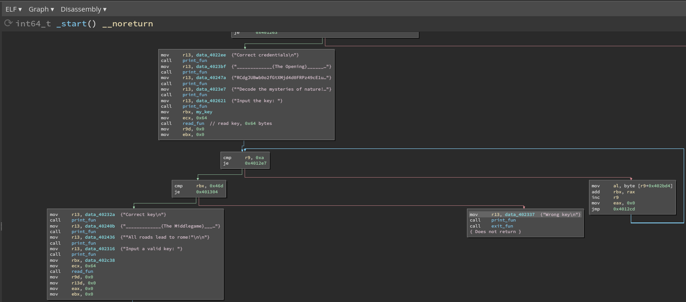

# The Matrix
Challenge: https://crackmes.one/crackme/617ec2cb33c5d4329c345422

The challenge is a "multi stage" challenge where we are asked for a couple of input and these are verified in different ways.

## Credential
The first step is the credential. We are asked for username and password. These are checked by a function that return 2 if the input string is equal to another harcoded one. If both password and username are correct we get the sum of 4 and pass the check.  

Hardcoded credential are:
- Username: `admin`
- Password: `password` 

## The Opening
The following string is printed:

`RCdgJUBwb0o2fGtXMjd4d0FRPz49cE1ubko3WkdpZ0NDQS8/YT5PXykocnFwdXRtbDJwaWhtbGtqaWhnYCZHXWJhWll9QD9bVFN3UVB0VE1McEpPSGxMLkpJSEdAZEQmQkE6OThcfTU6MzgxVS8uMyxQcSkuJyYlJEgoJyYlJGQieT99X3U7eXh3dm81bXJxamluZ2YsZGNoZ2ZlXl0jW2BZWF1WenlTUlFQVU5yTFFKbk4wL0VEQ2dHRihEQ0JBQDldPTZ8OjNXeDYvLjMsUCopTScsJSQpIkYmZmUjekB+d191dHl4cTdvV3NycXBpL21sa2QqaGdgZV5dI2FaWV5dXFV5WVhXUE9zU1JRSm4xMEZLRGgrQUZFREM8O18/IT08OzozV3gwNS4tLCtPKU1ubSsqKSInfkQx`

Then we are asked for a key. The program takes a string (up to 0x64 bytes long) and checks if the sum of the first 10 characters is equal to 0x46d. 

So I choose to use the following sequence of characters: 
`}}}}}}}iQH` 

## THe Middlegame

We are asked for a second key. This time the program uses the second key in combination of the first key as follows:

So essentially for each byte: 
a = ke1 + key2 
a = a >> 3 bit 
a *= 4 
sum += a 

condition to match: sum should be equal to 0x3d8 
After some math calculus the following string will match the requirements:

`EEEEEEcgox` 

## The Endgame
In the final part we have to provide the same input 3 times

The inner function is:

At each iteration the outer function takes our input, calls an inner function that checks if we supplied a string number and translates it into the actual number, by subtracting 0x30 from every ascii value and multiply by a power of 10 to move it to the corresponding position. Return number is passed in register r9. 
That number is used to solve a cubic equation which basically is (r9 is renamed as "x" in the formula):
 
x^3 - 6063 x^2 + 12253322 x - 8254653240 = 0 
 
The valid solutions are: 
`x1,x2,x3 = 2022, 2021, 2020` 
